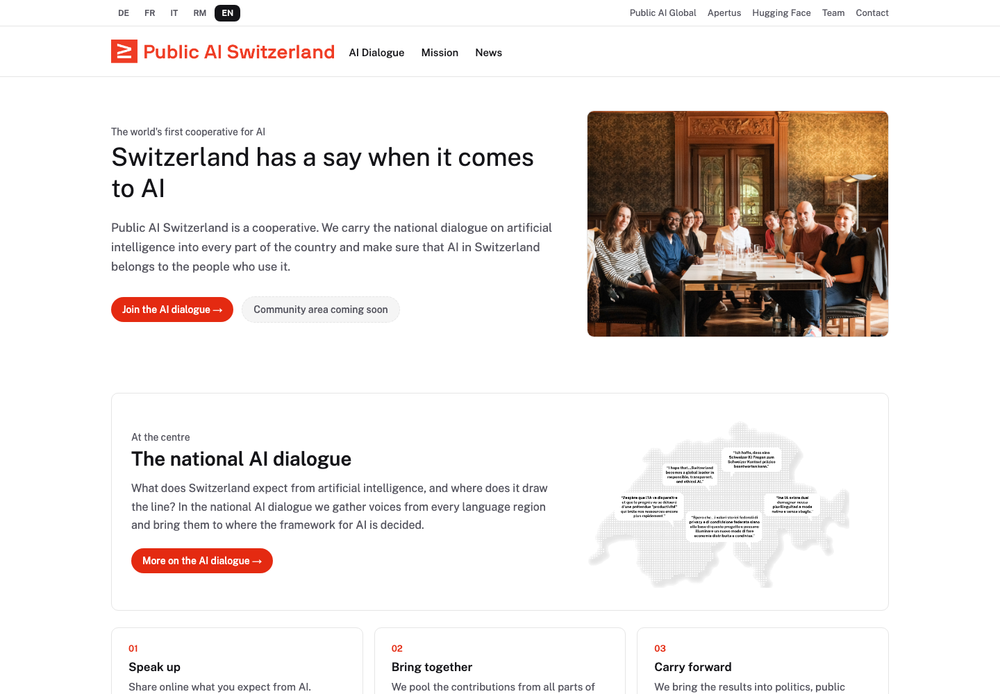
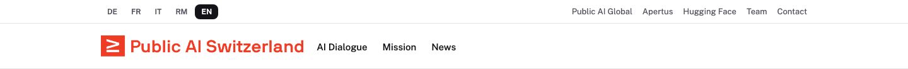
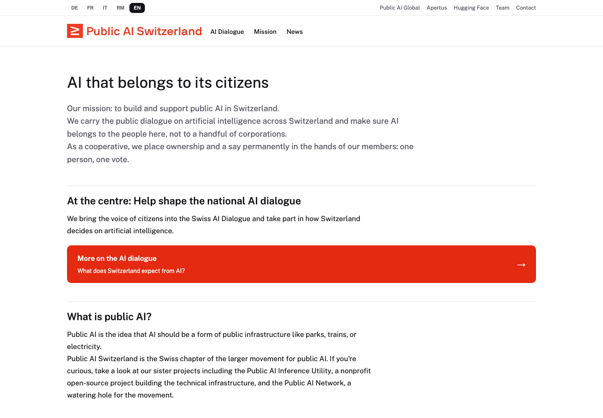
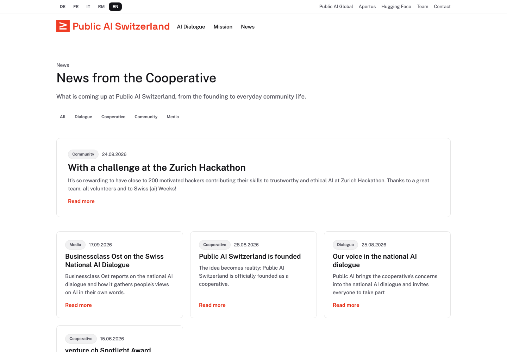
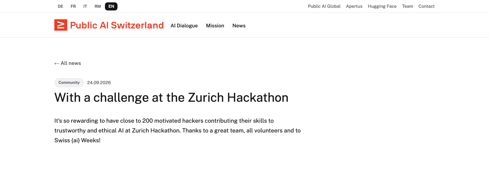
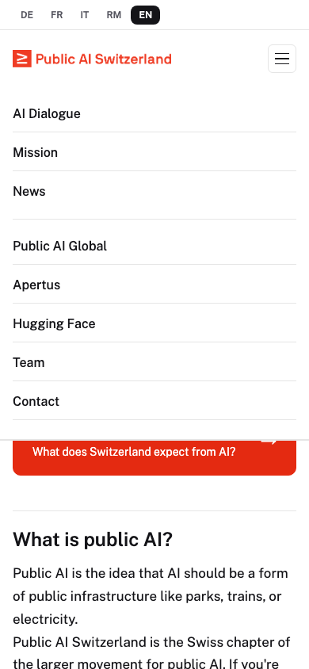

# Quick Guide for Content Contributors
A friendly handbook for updating pages, publishing news, and changing navigation.

You do not need to understand React to make everyday content changes. Most of the work happens in three places: text in `content/`, pictures in `public/assets/`, and navigation in `config.json`.



This guide follows the repository as it stood on 8 October 2026. The screenshots show a local development preview of that code, rather than the deployed website. Example text and filenames are teaching examples, not changes made to the site.

## Find what you need
2 - Where things live | 3 - Run a preview | 4 - Edit a page | 5 - Create a page | 6 - Languages | 7 - Formatting and images | 8 - Publish news | 9 - Review news | 10 - Menus | 11 - Footer and mobile | 12 - Check and publish | 13 - Troubleshooting and sources

<!-- page -->
# 2. Where things live
Think of the repository as a shared working folder. The editable text and the program that displays it live together, but you usually only need a few files.

## Your everyday files
- `content/`: page text in MDX files. MDX means Markdown text with optional ready-made layout blocks.
- `content/news/`: articles. A filename looks like `2026-09-24-zurich-hackathon.mdx`.
- `content/templates/`: starting files to copy. These files are never published as pages.
- `public/assets/`: images and downloads that visitors can access.
- `config.json`: header links, footer links, news categories, redirects and a few site switches.
- `docs/`: the existing tutorials, instructions and technical references. This guide lives in `docs/pdf/`.

## Files you usually leave to developers
- `app/` handles addresses and page rendering. The home page starts in `app/routes/home.tsx`.
- `src/` holds shared components, styles, the content pipeline, and home-page sections in `src/sections/home/`.
- `tests/` checks the code and browser behaviour.
- `tools/` contains an optional MDX authoring skill.
- `build/client/` is generated by the production build. Never edit it to change page text; your edits will be overwritten.

## Find a page from its address
The page at `/mission/` comes from `content/cooperative/mission.mdx`. The folder groups related work; it does not appear in the address. The German version is `/de/mission/`.

News has a different address shape: `content/news/2026-09-24-zurich-hackathon.mdx` becomes `/news/2026-09-24-zurich-hackathon/`.

The home page and the News listing are generated by code. There is no home-page MDX file and no `news.mdx` to edit. Publishing an article updates the News listing and the home news teaser automatically.

<!-- page -->
# 3. Run a local preview
A preview lets you check your work before it reaches visitors. You need Git, Node.js 20 or newer, and the Yarn version chosen by the project. A text editor such as VS Code is useful.

## First setup
If you do not have the repository yet, run:
```bash
git clone https://github.com/forpublicai/publicai.ch.git
cd publicai.ch
```
If you already have a copy, open a terminal in that repository folder instead. Then run:
```bash
corepack enable
yarn install --immutable
yarn dev
```
Corepack provides the pinned Yarn version. If Corepack is missing or its setup is blocked by your machine's permissions, ask your technical maintainer to help. Use Yarn for this project, rather than `npm install`. Yarn uses Plug'n'Play here, so the absence of a `node_modules` folder is normal.

## Open the address printed in the terminal
It is usually `http://localhost:5173/`. Keep the terminal open while working. Save a text edit, then check the browser. Stop the server with Ctrl+C when you are finished.

Restart `yarn dev` when you add or delete a file, add or remove language sections, or change whether a page has a route, such as its `draft` status. Ordinary wording edits refresh live. If a configuration edit looks stale, refresh the page and restart the server.



The small top row contains language choices and utility links. The larger row contains the logo and the main menu. Both menus get their entries from `config.json`.

<!-- page -->
# 4. Change an existing page
Start with a small edit. You do not need to copy a template to update a page that already exists.

## A simple editing routine
1. Find the MDX file whose filename matches the page address. For `/mission/`, open `content/cooperative/mission.mdx`.
2. Find the section for the language you want to change, such as `<!-- locale: en -->`.
3. Edit the text below that marker, stopping at the next language marker.
4. If the heading or summary changes too, update that language's title and description at the top of the file.
5. Save, inspect the page in the local preview, and run `yarn build` before submitting the change.



The large page heading comes from the title fields at the top of the file. The body comes from the language section. For an ordinary section heading inside the body, use `## Heading` rather than adding a second main heading with `#`.

## The two parts of an MDX file
The block between the opening pair of `---` lines is called frontmatter: short settings such as a title and description. Everything after it is body content, divided by language markers. Keep these two parts in place while editing.

You can edit one language at a time, but a wording change does not translate itself. Review the other languages when a fact, date, link or meaning changes.

<!-- page -->
# 5. Create a new page
Choose a short, stable filename using lowercase letters, numbers and hyphens. It must be unique anywhere in the page content tree. Avoid the reserved names `news` and `authors`.

## Copy the starting file
For example, create a Workshops page:
```bash
mkdir -p content/community
cp content/templates/page-template.mdx content/community/workshops.mdx
```
You can also copy and rename the file in your editor. In the copied template, remove the explanatory paragraph between the closing frontmatter `---` and the first language marker. Both page and news templates currently contain this kind of instruction text. No body text may sit before the first marker.

## A complete, small starting example
```mdx
---
title: Workshops
description: Meet the community and take part in our public AI workshops.
---

<!-- locale: en -->

Come and learn with us.

## What to expect

We share ideas, try tools, and learn together.

[Read our mission](/mission)
```
This creates the English page `/workshops/`. It does not create German, French, Italian or Romansh pages until you add those sections. The example only includes English deliberately; replace the text with your approved content.

## Help visitors find it
Add a link from an existing page or add a menu/footer entry in `config.json` (page 10). A new page does not add itself to the menu. The production build checks that published pages are reachable from the home pages.

Restart the development server, open `/workshops/`, and run `yarn build`. If you are still drafting, set `draft: true` in frontmatter. Drafts have no routes, even in development; you cannot browse them until you remove that flag or set it to `false` locally.

<!-- page -->
# 6. Write and check each language
The five language codes are `en` (English), `de` (German), `fr` (French), `it` (Italian), and `rm` (Romansh). One file holds every available translation of a page.

## Body text uses marker lines
```mdx
<!-- locale: en -->

Our next workshop is open to everyone.

<!-- locale: de -->

Unser nächster Workshop steht allen offen.
```
Each marker must be on its own line. Use each language at most once. The order is flexible; existing templates start with German. Leave a blank line after a marker. Keep at least one language section, and do not leave placeholder or empty sections as if they were finished translations.

## Translate headings and summaries too
```yaml
title: Workshops
title_de: Workshops
title_fr: Ateliers
description: Discover our workshops and join the next community gathering.
description_de: Entdecken Sie unsere Workshops und das nächste Treffen.
```
`title` and `description` are required base fields. Add `title_en`, `title_de`, `title_fr`, `title_it`, `title_rm` and the matching `description_...` fields when needed. A missing override uses the English override, then the German override, then the base field. The base field is not inherently German, even though the templates use German there. Set explicit overrides for each finished translation to avoid surprising headings.

## Check the real addresses
English: `/workshops/`. German: `/de/workshops/`. Other languages use `/fr/`, `/it/` and `/rm/` in the same way. Only languages with a marker have a page route. Switching to a missing translation may reach a 404; do not assume an English page will appear at that language's address.

The News listing exists in all five languages and can show a fallback title or excerpt. That does not create a translated article. Always click through while reviewing. The build's `untranslated-sections-report.txt` records missing sections when there are gaps.

<!-- page -->
# 7. Format text and add pictures
Most page content is ordinary Markdown. You can write it directly without importing anything.
```mdx
## A section heading

A paragraph with **bold words** and *emphasis*.

- First point
- Second point

[Our mission](/mission)
[An external resource](https://publicai.co)
```
Internal links such as `/mission` get the section's language prefix automatically. Use links to pages that exist in the languages you are publishing. For a news article, use its full path, for example `/news/2026-09-24-zurich-hackathon/`. Links to a file in `/assets/` are downloads or images, not page slugs.

## Put images in the public assets folder
For example, save `workshop.jpg` in `public/assets/images/workshops/`. The address you write in MDX starts at `/assets/`; do not include `public`.
```mdx
<Figure
  src="/assets/images/workshops/workshop.jpg"
  alt="Participants discussing ideas around a workshop table"
  caption="A community workshop in Zurich."
/>
```
The example requires that image file to exist. Match spelling and capitalisation exactly. Write alt text that describes the useful visual information, and translate the caption and alt text in each language section.

## Ready-made blocks can help
```mdx
<Lead>A short introduction that stands out.</Lead>

<Callout variant="info">
  Registration details will be shared soon.
</Callout>

<CTA title="Read our mission" to="mission" />
```
Component names and property names are case-sensitive. `to="mission"` means a page slug, without slashes; an external CTA uses `href="https://..."`. Keep one of `to` or `href`. Reuse blocks rather than writing new styling. More options, including tables, accordions and team cards, are in `docs/reference/components.md`. Embeds must use an approved host in `config.json` under `embeds.allowlist`.

<!-- page -->
# 8. Publish a news article
News is an MDX page with both a `date` and a `category` in its frontmatter. The folder name alone does not make something news.

## Copy, rename, and clean the template
```bash
cp content/templates/news-template.mdx content/news/2026-10-08-community-workshop.mdx
```
Delete the explanatory text before the first language marker in your copy. Replace all placeholder titles, descriptions and body sections. Use the publication date at the start of the filename, and make the frontmatter date match it.

## A small article example
```mdx
---
title: A community workshop
description: Our community explored public AI and planned the next steps.
date: 2026-10-08
category: Community
---

<!-- locale: en -->

We met to exchange ideas and learn together.

## What happens next

[Learn about our mission](/mission)
```
This example would live at `/news/2026-10-08-community-workshop/`. Add actual reporting and translations before publication. As with pages, setting `draft: true` hides the article entirely, including its preview route.

## Choose an existing category
The current choices in `config.json` under `news.categories` are `Dialog`, `Genossenschaft`, `Community`, `Medien`, and `Technik`. Match the spelling exactly. If you need a new category, add it to that list and check the resulting filter label.

`description` is the listing teaser; make it understandable on its own. Use the per-language description fields for translated teasers. Optional `heroImage: /assets/images/news/workshop.jpg` supplies the card and article image; put the real image at the matching path under `public/`.

A future date does not schedule publication. Once an article is not a draft, it can appear in the next build regardless of that date. Keep it a draft until it is ready to publish.

<!-- page -->
# 9. Review how the news appears
The site builds the News page for you. You do not manually add a card to a list or edit the home page to announce a new article.



Articles sort by frontmatter date, newest first. The first listing page features the newest article; the remaining entries appear in a grid. The home teaser shows the latest three published articles. Categories filter the listing in place, and the index shows up to ten articles at a time. A category with no published articles does not appear as a filter.



## Two optional features
To point readers to reporting elsewhere, add `externalUrl: https://example.org/article` to a news item. It appears in the listings but has no local article route. Its title and description still need useful copy. Use the actual external address rather than the example above.

Author records live in `content/authors/`, and an article can use `author: daria-hoehener`, for example. That ID must match a real file. Author displays and author routes are currently disabled by `news.authorsEnabled: false` in `config.json`. Adding an author field will not turn the feature on; restoring authors is a separate site change.

<!-- page -->
# 10. Change the menu in config.json
Open `config.json` at the root of the repository. `menus.main` supplies the larger menu beside the logo; `menus.utility` supplies the smaller row above it. An optional `menus.cta` supplies a prominent action. The current config has no CTA and no dropdown menu.

## Add a page link
To link your Workshops page, add this object inside the `menus.main` array, next to its other entries:
```json
{
  "label": {
    "en": "Workshops",
    "de": "Workshops",
    "fr": "Ateliers",
    "it": "Workshop",
    "rm": "Lavuratoris"
  },
  "page": "workshops"
}
```
The example labels illustrate the format; have translated wording reviewed. All five language keys are required and must contain text. The `page` value is a filename slug without `.mdx`, folders or slashes. The target page must exist. The reserved value `news` opens the generated News listing.

## Keep JSON punctuation intact
Entries sit between `[` and `]`, and each entry sits between `{` and `}`. Put a comma between neighbouring entries, but no comma after the last one. JSON needs double quotes and does not allow comments. Your editor can highlight a missing comma or bracket.

## Choose one kind of target
- `page`: an internal page, such as `"page": "mission"`.
- `url`: an external address, such as `"url": "https://publicai.co"`, or a `mailto:` address.
- `children`: a non-empty array of menu entries for a dropdown. Each child needs its own label and target. Keep header dropdowns to one level.

Use exactly one of these keys per item. For an external link, replace `page` with `url`; do not keep both. Entries appear in array order, so move a complete object to reorder the menu. Removing a menu entry does not delete its page, but can leave that page unreachable if no other link points to it.

<!-- page -->
# 11. Footer links and the mobile menu
The footer is also configured in `config.json`. A footer entry uses the same five-language label and `page` or `url` target as a menu entry.


`footer.columns` is a list of columns. Each has a translated `title` and an `items` array of links. Edit the relevant column, or move a whole column to change their order. `footer.tagline` changes the short description beside the columns; `footer.copyright` changes the bottom line. Both use five-language objects.

There is currently no `footer.newsletter` setting in the schema or footer renderer. The home page's newsletter section lives in `src/sections/home/newsletter.tsx`; adding the old documented footer setting will not create a newsletter button.

## Check a narrow screen too


The same main and utility entries fold into the mobile menu. After a change, narrow the browser or use its device preview, open the menu button, and click the updated link. Check that long translations fit and that the menu closes after navigation.

<!-- page -->
# 12. Check your work and publish
A saved file changes your local preview. It does not change the live website. The deployed site serves generated HTML, so content changes need a new build and deployment.

## Before you hand over a change
1. Read the page in every language you changed. Check its main heading, summary, body, links and images.
2. For a new page, check that a menu, footer or existing page links to it. For news, check the listing and click the article.
3. Look at a narrow screen and open the mobile menu if you changed navigation.
4. Build the site, then browse the built version:
```bash
yarn build
yarn preview
```
The preview is usually `http://localhost:4173/`; use the address the terminal prints. `yarn build` checks content and references, renders static pages, verifies links and reachability, and creates the sitemap and other output. It does not run every repository test automatically.

## The complete repository checks
These are separate commands used for release validation:
```bash
yarn lint
yarn typecheck
yarn test
yarn build
yarn test:e2e
```
Browser tests need Chromium installed via `yarn playwright install chromium`.

## Hand over the source changes
Follow your team's review process. Include the MDX, config and asset files you changed, and say which languages you checked. Keep generated output and local dependency caches out of the change submission.

In this repository, the GitHub workflow checks pull requests, and upstream `main` builds and deploys through the configured FTP job. A local edit or a fork does not deploy by itself. For a manual upload, the deployment artifact is only `build/client/`; consult `docs/deploy/server-admin-guide.md` and the maintainer's process before deployment.

<!-- page -->
# 13. When something goes wrong
Build errors usually name the file or configuration field to fix. Start there, save the correction, and build again.

- **Content before the first locale marker:** remove the template's instruction paragraphs between frontmatter and the first marker. All body content belongs after a marker.
- **Unknown or duplicate locale:** use only `en`, `de`, `fr`, `it`, `rm`, with one marker per language.
- **Duplicate slug:** another page has the same filename, even if it is in another folder. Pick a unique filename before publication.
- **Invalid frontmatter:** check the required title and description, the `---` delimiters, and the spelling of fields. Use flat, single-line `key: value` entries; this parser does not support nested YAML or multiline descriptions.
- **Unknown category or author:** use a category from `news.categories` or an author ID with a real MDX record.
- **Invalid config or missing label:** check commas, brackets and all five language keys. An error such as `menus.main.2.label.fr` points into the third main-menu item; array positions start at zero.
- **Unreachable page:** link to it from an existing reachable page or navigation. `pages.excluded` deliberately exempts a page from sitemap/reachability checks; it does not hide or delete the route.
- **404 in the preview:** check the slug, language marker and draft status, then restart `yarn dev`. Link-out news has no local route. A missing translation has no route either.
- **Wrong translated heading:** set that language's `title_...` and `description_...` fields explicitly.

## If you rename or remove a published page
Old links can still be in emails or search results. Update incoming links and menu entries, and add explicit old-to-new paths in `pages.redirects` where appropriate. For example:
```json
{ "from": "/old-page/", "to": "/mission/" }
```
Add the corresponding translated paths as needed. Redirects are generated forwarding pages, not automatic preservation of every old address. `noindex: true` keeps a route accessible but asks search engines not to index it; `draft: true` removes the route.

## Sources and accuracy notes
Based on the root `README.md`, `CONTRIBUTING.md`, `docs/tutorials/first-page-in-15-minutes.md`, the page/news/menu how-to guides, and the frontmatter, component, config, URL and build-gate references. Behaviour was checked against `app/routes.ts`, `src/lib/mdx-page-model.ts`, `src/lib/config.ts`, the header/footer renderers, and the actual `config.json`.

Where older prose disagreed, this guide follows the code: translated metadata is supported; drafts have no dev routes; missing language sections have no page routes; both templates contain pre-marker instructions; authors are disabled; the footer newsletter setting is absent. Screenshots were captured from this repository's local preview on 8 October 2026.
